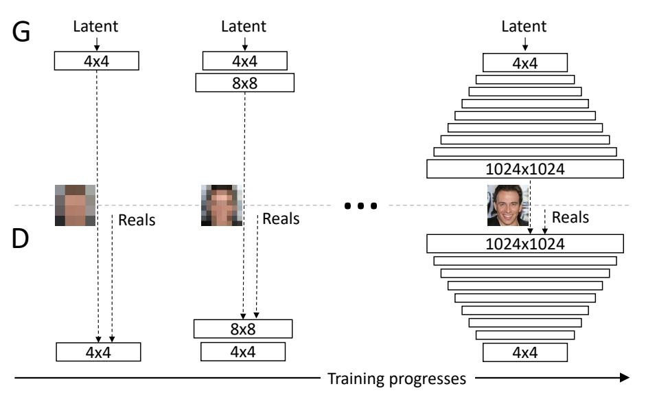
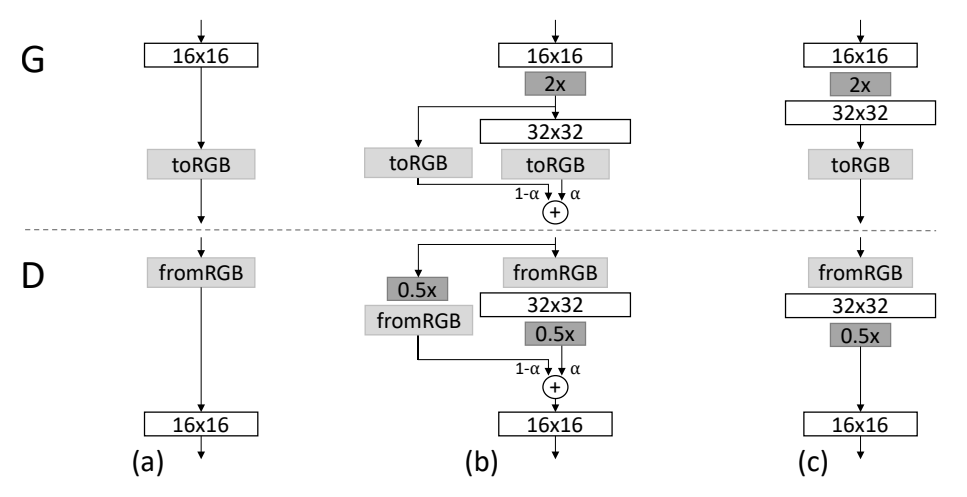

# PGGAN - Pytorch Implementation
PyTorch Implementation of [Karras et al., "Progressive Growing of GANs for Improved Quality, Stability, and Variation" (ICLR 2018)](https://arxiv.org/abs/1710.10196).

-----
# Getting Started
## Dataset

## Installation

-----
# Usage
## Train

```bash
python train.py --model_id pggan --run_id simple_test
```
If you want to use multi GPUs, add "--use_mGPU"
```bash
python train.py --model_id pggan --run_id simple_test --use_mGPU
```

If you want to use wandb, add "--use_wandb"
```bash
python train.py --model pggan --run_id simple_test --use_wandb
```

If you want to load a checkpoint and retrain it, use "--ckpt_id"
```bash
python train.py --model pggan --run_id simple_test --ckpt_id={PATH/TO/CKPT} 
```
## Generate (not implemented yet)
```bash
python test.py --model_id pggan --run_id simple_test
```

-----
# Overview
## Progressive Growing of GANs

Starting from low resolution image generating network, progressively add new blocks with larger scale to both generator and discriminator. In our code, for every `scale_jump_step`, both `model.G` and `model.D` call `add_block` function. 

## Smooth Resolution Transition

To fade the new blocks smooothly, there are weighted residual connections between layers. The generator upscales the previous block feature map by 2, then blends it with the new block feature map in the RGB domain.
```python
for i, block in enumerate(self.blocks, 0):
    x = block(x)
  
    # Lower scale RGB image
    if self.alpha > 0 and i == (len(self.blocks) - 2):
        x_prev = self.toRGB_blocks[-2](x, apply_upscale=True)

# Current scale RGB image
x = self.toRGB_blocks[-1](x)

# Blend!
if self.alpha > 0:
    x = self.alpha * x_prev + (1.0 - self.alpha) * x
```
 
 On the other hand, the discriminator downscales the current RGB input by 2 and pass it to the previous block. In this case, blending occurs in the feature domain.  
```python
# Lower scale features
if self.alpha > 0 and len(self.fromRGB_blocks) > 1:
    y = self.fromRGB_blocks[-2](x, apply_downscale=True)

# Current scale features
x = self.fromRGB_blocks[-1](x)

apply_merge = self.alpha > 0 and len(self.blocks) > 1
for block in reversed(self.blocks):
    x = block(x)

    # Blend!
    if apply_merge:
        apply_merge = False
        x = self.alpha * y + (1 - self.alpha) * x
```

## Objectives
**WGAN-GP loss** is used. Both generator and discriminator are optimized per every minibatch. Indeed, the original paper introduces an additional term into the discriminator loss, but this is not implemented yet. 

-----
## TO DO
- [ ] implement fourth term of discriminator loss 
- [ ] implement test.py
- [ ] upload requirements.txt
- [ ] upload checkpoint and sample output

## Authors
* Yukyeong Lee - geo1106@innerverz.com
* Wonjong Ryu

## Acknowledgements
* Karras et al. "Progressive Growing of GANs for Improved Quality, Stability, and Variation" (ICLR 2018) [[paper](https://arxiv.org/abs/1710.10196)][[code](https://github.com/tkarras/progressive_growing_of_gans)]
* [facebookresearch/pytorch_GAN_zoo](https://github.com/facebookresearch/pytorch_GAN_zoo) 
